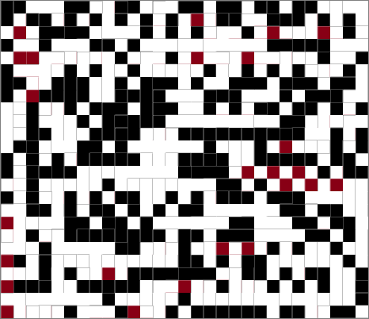

# Testing-App for Learning about Wavefunction Collapse

## What is Wavefunction Collapse?

I was inspired to learn about this by watching https://www.youtube.com/watch?v=20KHNA9jTsE.

Interesting examples can be found at https://github.com/mxgmn/WaveFunctionCollapse.

## What does it do?

<table>
<thead>
<tr>
<th>Version 1</th>
<th>Version 2</th>
</tr>
</thead>
<tbody>
<tr>
<td>Base Image: </td>
<td>Base Image: </td>
</tr>
<tr>
<td></td>
<td></td>
</tr>
<tr>
<td>
<ul>
    <li>Version 1 does not much really, but it took the
     base image and managed to do the basics</li>
    <li>here the selection of tiles is only
     chosen based on the previous player position</li>
    <li>the performance is really bad</li>
</ul>
</td>
<td>
<ul>
    <li>Version 2 however improves here significantly</li>
    <li>the new tile is chosen based on all
     existing neighbors and their potential connections</li>
    <li>the performance is also way better</li>
</ul>

</td>
</tr>
</tbody>
</table>

# Technical stuff

## What frameworks are used?

* React
* Fabric.js
