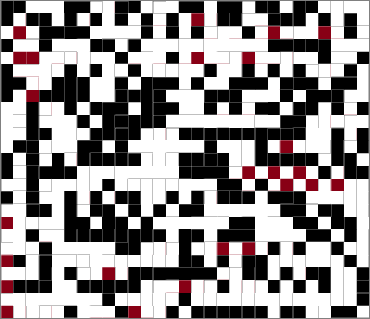

# Testing-App for Learning about Wavefunction Collapse

## What is Wavefunction Collapse?

I was inspired to learn about this by watching https://www.youtube.com/watch?v=20KHNA9jTsE.

Interesting examples can be found at https://github.com/mxgmn/WaveFunctionCollapse.

## What does Version 1 do?

Not much really, but it took the base image  and produced this:

# Technical stuff

## What frameworks are used?

* React
* Fabric.js
